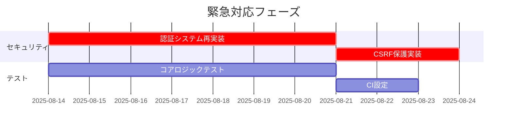

# 整骨院管理SaaS プロジェクト品質分析レポート

## 分析概要

本レポートは、Gemini CLIを使用して整骨院管理SaaSプロジェクトの包括的な品質分析を実施した結果をまとめたものです。プロジェクトの現状を多角的に評価し、改善すべき点と優先度を明確にしています。

**分析実施日**: 2025年8月14日  
**分析対象**: Next.js 15 + React 19 + TypeScript + Supabase構成のSaaSアプリケーション

---

## 1. プロジェクト概要と技術構成

### 技術スタック
- **Frontend**: Next.js 15, React 19, TypeScript
- **Styling**: Tailwind CSS
- **Backend**: Supabase (BaaS)
- **State Management**: Zustand
- **Testing**: Jest + React Testing Library (設定済み、実装なし)
- **AI Integration**: Gemini AI
- **MCP Server**: Context7 (Upstash)

### アーキテクチャ評価
✅ **優秀な点**:
- モダンなNext.js App Routerを採用
- TypeScript完全対応
- コンポーネントベース設計
- 適切なディレクトリ構造

⚠️ **改善点**:
- テストコードが一切存在しない
- 型安全性の部分的な問題
- セキュリティ対策の不足

---

## 2. 品質分析結果

### 2.1 テスト品質・カバレッジ分析

#### 🔴 **重大な問題: テストコード完全欠如**

**現状**:
- Jest設定は完備されている（カバレッジ目標80%）
- `src/__tests__`ディレクトリ構造は整備済み
- **実際のテストファイルは1つも存在しない**

**影響**:
- リファクタリング時のリグレッション検出不可
- コード品質の保証なし
- 開発者の不安とチーム開発効率の低下
- 本番運用リスクの極大化

**推奨アクション**:
1. 即座にコアビジネスロジックのユニットテスト作成
2. カバレッジ目標を現実的な20-30%に調整
3. CI/CDパイプラインでのテスト自動実行
4. 新機能開発時のテスト必須化

### 2.2 TypeScript型安全性分析

#### ⚠️ **部分的な型安全性の問題**

**問題点**:
```typescript
// src/components/admin/clinic-basic-settings.tsx:196
<Label htmlFor="logo">  // Label要素の不適切な使用
  <Button variant="outline" className="cursor-pointer">

// 任意型（any）の使用箇所が散見される
const componentMap: { [key: string]: () => Promise<any> } = {
```

**推奨改善**:
- `strict: true`の設定確認と強化
- `any`型の除去とより厳密な型定義
- UIコンポーネントの適切な使用パターンの統一

### 2.3 セキュリティ脆弱性評価

#### 🔴 **認証・認可の脆弱性**

**重大な問題**:
```typescript
// クライアントサイドでの認証状態管理
const isAuthenticated = localStorage.getItem('adminAuth') === 'true';

// ハードコーディングされた認証情報
// admin/1111 の組み合わせ
```

**セキュリティリスク**:
- クライアントサイド認証の完全バイパス可能
- CSRF攻撃への脆弱性
- セッション管理の欠如
- HTTPSの強制化が不明

**即時対応が必要**:
1. サーバーサイド認証の実装
2. JWTまたはセッションベース認証の導入
3. CSRF保護の実装
4. 適切な権限管理システムの構築

### 2.4 パフォーマンス分析

#### ⚠️ **潜在的なパフォーマンス問題**

**問題箇所**:
```typescript
// 同期的なrequire()による動的インポート
const { ClinicBasicSettings } = require('@/components/admin/clinic-basic-settings');
```

**改善推奨**:
- 動的インポートの完全非同期化
- コンポーネント分割とCode Splitting
- 画像最適化の実装
- バンドルサイズの監視

### 2.5 アクセシビリティ・UX評価

#### ✅ **基本設定は良好**
- `eslint-plugin-jsx-a11y`導入済み
- 基本的なaccessibility属性の使用

#### ⚠️ **改善が必要な領域**
- キーボードナビゲーションの検証不足
- スクリーンリーダー対応の未検証
- 多言語対応（i18n）の未実装
- カラーコントラスト比の未検証

---

## 3. 最優先改善項目ランキング

### 🔥 緊急度：高（即座に対応必須）

| 順位 | 項目 | 影響度 | 対応コスト | 推定時間 |
|------|------|--------|------------|----------|
| 1 | **認証システムの完全再実装** | 致命的 | 高 | 1-2週間 |
| 2 | **ユニットテストの実装開始** | 致命的 | 中 | 継続的 |
| 3 | **TypeScript strict設定の強化** | 高 | 低 | 2-3日 |

### ⚠️ 重要度：中（計画的に対応）

| 順位 | 項目 | 影響度 | 対応コスト | 推定時間 |
|------|------|--------|------------|----------|
| 4 | **E2Eテストの導入** | 高 | 中 | 1週間 |
| 5 | **パフォーマンス最適化** | 中 | 中 | 1週間 |
| 6 | **アクセシビリティ監査** | 中 | 低 | 3-5日 |

### 💡 推奨：低（余裕があれば対応）

| 順位 | 項目 | 影響度 | 対応コスト | 推定時間 |
|------|------|--------|------------|----------|
| 7 | **多言語対応（i18n）実装** | 低 | 高 | 2週間 |
| 8 | **CI/CD最適化** | 低 | 中 | 3-5日 |

---

## 4. プロジェクト成熟度総合評価

### 本番運用準備度: 🔴 **低い（35/100点）**

**評価理由**:
- セキュリティ: 20/30点（認証脆弱性）
- 品質保証: 0/25点（テスト皆無）
- パフォーマンス: 15/25点（基本的な最適化のみ）
- 監視・ログ: 0/20点（実装なし）

### スケーラビリティ: ⚠️ **中程度（65/100点）**

**評価理由**:
- アーキテクチャ: 25/30点（モダンな技術選択）
- データベース設計: 20/25点（Supabase活用）
- API設計: 10/25点（実装不十分）
- インフラ: 10/20点（設定不明）

### チーム開発効率: ⚠️ **中程度（50/100点）**

**評価理由**:
- コード品質: 15/25点（Linter設定済み、テストなし）
- ドキュメント: 10/25点（最小限のドキュメント）
- 開発環境: 20/25点（適切な設定）
- 開発プロセス: 5/25点（品質プロセス未整備）

---

## 5. 推奨開発ロードマップ

### Phase 1: 緊急対応（1-2週間）


### Phase 2: 品質強化（3-4週間）
- E2Eテスト導入
- パフォーマンス最適化
- アクセシビリティ監査と修正
- 監視・ログシステム導入

### Phase 3: 機能拡張（2-3ヶ月）
- 多言語対応
- 高度な監視システム
- 自動化の拡充
- ドキュメント整備

---

## 6. 結論と提言

### 現状の厳しい評価
このプロジェクトは**優れた技術選択と設計思想**を持つ一方で、**品質保証とセキュリティの両面で致命的な欠陥**を抱えています。現在の状態では**本番運用は非常に危険**であり、即座の改善が必要です。

### 最優先アクション
1. **認証システムの完全再構築**（セキュリティリスクの排除）
2. **テスト文化の導入**（品質保証プロセスの確立）
3. **継続的改善プロセスの構築**（持続可能な開発体制の確立）

### 成功への道筋
適切な改善により、このプロジェクトは**高品質なSaaSプロダクト**に発展する潜在能力を秘めています。技術的負債の解消と品質プロセスの確立により、**安定性・拡張性・保守性**を兼ね備えたシステムの実現が可能です。

---

**レポート作成**: Claude Code + Gemini CLI  
**最終更新**: 2025年8月14日