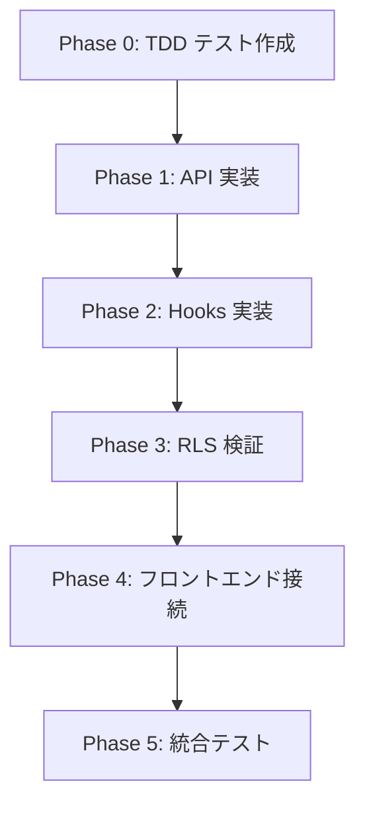

# ハードコードデータ動的化仕様書 v0.1

## Overview

- **Purpose**: UIにハードコードされた通知バッジ・クリニック選択・ホームページ統計を、Supabase テーブルから動的に取得するよう実装する。
- **Priority**: Critical（通知バッジ・クリニック選択は全画面に影響）
- **Risk**: RLS ポリシー不備によるクロステナントデータ漏洩、または過剰遮断
- **Status**: PARTIALLY IMPLEMENTED（2026-02-27 実装完了: Phase 2 FE-01〜FE-03 + `/api/clinics` API。詳細は末尾「実装状況」セクション参照）
- **関連分析**: `hardcoded_data_analysis.md`（Gemini レビュー結果）

---

## 対象ハードコード箇所

| # | ファイル | ハードコード内容 | 対応テーブル | 深刻度 | 実装状況 |
|---|---------|---------------|------------|:---:|:---:|
| HC-01 | `src/components/navigation/header.tsx:141` | 通知バッジ `3` | `notifications` | 🔴 | ✅ 解消 |
| HC-02 | `src/components/navigation/header.tsx:50` | クリニック `['本店','新宿店',...]` | `clinics` | 🔴 | ✅ 解消 |
| HC-03 | `src/app/page.tsx:69` | 店舗数 `46` | `clinics` | 🟠 | ✅ 解消 |
| HC-04 | `src/app/page.tsx:73` | システム状態 `稼働中` | `security_events` | 🟠 | ✅ 部分解消 ※1 |
| HC-05 | `src/app/page.tsx:77` | AI分析 `AI分析` | `ai_comments` | 🟡 | ⚠️ 仮実装 ※2 |
| HC-06 | `src/app/reservations/page.tsx:231` | 通知配列 `[] as Notification[]` | `notifications` | 🟠 | ❌ 未実装 |
| HC-BUG | `src/components/navigation/header.tsx:51` | UUID vs 名前文字列の型不一致 | — | 🔴 | ✅ 解消 |

> ※1 **HC-04**: `security_events` ではなく既存 `/api/health` の `ok` フラグで判定。`degraded`/`outage` 状態の詳細検出には API-03 実装が必要。
> ※2 **HC-05**: `useSystemStatus` フックが常に `'active'` を返す仮実装。`ai_comments` テーブルの当日データ検証は API-03 実装後に対応予定。

---

## Scope

### In Scope

1. **新規API 3本** の実装
   - `GET /api/notifications` — 一般ユーザー向け通知一覧 + 未読件数 ❌ 未実装
   - `GET /api/clinics/accessible` — ユーザーがアクセス可能なクリニック一覧 ❌ 未実装
     → **代わりに `GET /api/clinics`（全アクティブクリニック）を実装** ✅
   - `GET /api/system/status` — ホームページ用システム統計 ❌ 未実装
     → **代わりに `useSystemStatus` が `/api/clinics` + `/api/health` を並列呼び出し** ✅
2. **RLS ポリシーの検証・補強** — 既存 `notifications` ポリシーの確認、新 API 用のアクセス制御 ✅
3. **フロントエンド接続** — 6 箇所のハードコードを API 呼び出しに置換（5/6 完了） ✅
4. **TDD** — テストファーストで全 API ・フック・コンポーネントを実装 ✅

### Out of Scope

- UI/UX デザイン変更（カラーパレット・アイコン統一等は別仕様）
- ダークモード実装の統一
- 英語テキストの日本語化（ローディング・エラーメッセージ）

### DoD Mapping

- **DOD-08**: tenant boundary と RLS 一貫性の担保（`notifications`/`clinics`/`security_events`/`ai_comments`）
- **DOD-09**: クライアントからの直接テナント境界バイパス回避（本仕様の取得は API Route 経由）
- **DOD-10**: 実装後に `npm run build` で再現可能ビルドを確認

---

## 依存関係・前提

- RLS ヘルパー関数が利用可能:
  - `public.get_current_role()` / `public.can_access_clinic(UUID)` / `public.jwt_is_admin()`
  - `public.belongs_to_clinic(UUID)`（`can_access_clinic` への委譲）
  - `public.custom_access_token_hook(jsonb)`（`clinic_scope_ids` claim 付与）
- `notifications` テーブルの既存 RLS:
  - `"Users can view their own notifications"`（`auth.uid() = user_id` **または** 同一clinicの `clinic_admin/admin`）
  - `"notifications_insert_service_role"`（INSERT は service_role 限定）
- `clinics` テーブルの既存 RLS:
  - `"clinics_own_select"`（`public.can_access_clinic(id)`）
  - `"clinics_admin_select"`（`admin/clinic_admin` かつ `public.can_access_clinic(id)`）
- `security_events` テーブルが実体（`system_events` テーブルはローカル環境に存在しない）
- ロール定義: `src/lib/constants/roles.ts` に準拠
  - STAFF_ROLES: `admin`, `clinic_admin`, `manager`, `therapist`, `staff`
  - CLINIC_ADMIN_ROLES: `admin`, `clinic_admin`, `manager`

---

## Phase 1: 新規 API 実装

### API-01: `GET /api/notifications`

#### 概要

一般ユーザー（全ロール）が自分宛ての通知を取得する。

#### エンドポイント

```
GET /api/notifications
  Query Params:
    - limit?: number (default: 20, max: 100)
    - offset?: number (default: 0)
    - unread_only?: boolean (default: false)
    - include_count?: boolean (default: true)
  Response:
    {
      success: true,
      data: {
        notifications: Notification[],
        unreadCount: number,
        total: number
      }
    }
```

#### ファイル

- **[NEW]** `src/app/api/notifications/route.ts`
- **[NEW]** `src/hooks/useNotifications.ts`

#### RLS 依存

既存ポリシー `"Users can view their own notifications"` を使用:

```sql
CREATE POLICY "Users can view their own notifications" ON public.notifications
FOR SELECT USING (
  auth.uid() = user_id
  OR (
    clinic_id IS NOT NULL
    AND auth.jwt() ->> 'clinic_id' = clinic_id::text
    AND auth.jwt() ->> 'user_role' IN ('clinic_admin', 'admin')
  )
);
```

上記ポリシーは clinic_admin/admin に同一clinic通知の閲覧を許可するため、**一般向け `/api/notifications` では RLS 依存のみで自己通知限定にならない**。  
そのため API 実装で `auth.id` による明示フィルタを必須とする:

```ts
const { supabase, auth } = processResult;
const query = supabase
  .from('notifications')
  .select('*', { count: 'exact' })
  .eq('user_id', auth.id); // 必須: endpoint-level self filter
```

#### RLS 補強: API レベル防御（必須）

本仕様では DB ポリシー追加を行わず、以下で漏洩を防止する:

- `/api/notifications` は常に `eq('user_id', auth.id)`
- `clinic_id` での横断取得は許可しない（管理者ユースケースは `/api/admin/notifications` に限定）
- `limit` は `min(max(limit, 0), 100)` でクランプ

#### テスト計画 (TDD)

**1. ユニットテスト** — `src/__tests__/api/notifications.test.ts`

```
テストケース:
  TC-N01: 認証済みユーザーが自分の通知一覧を取得できる
  TC-N02: 未読通知のみフィルタで取得できる
  TC-N03: unreadCount が正しく返される
  TC-N04: limit/offset のページネーションが動作する
  TC-N05: 未認証リクエストは 401 を返す
  TC-N06: 他ユーザーの通知は RLS + endpoint-level filter により返されない
  TC-N07: limit の上限 (100) を超える値はクランプされる
  TC-N08: clinic_admin/admin でも他ユーザー通知は endpoint-level filter により返されない
```

**2. Hook テスト** — `src/__tests__/hooks/useNotifications.test.ts`

```
テストケース:
  TC-NH01: マウント時に通知を取得する
  TC-NH02: unreadCount が正しく state に反映される
  TC-NH03: エラー時に error state が設定される
  TC-NH04: 30秒ごとに未読件数をポーリングする
```

---

### API-02: `GET /api/clinics/accessible`

#### 概要

ログインユーザーがアクセス可能なクリニック一覧を取得する。ヘッダーのクリニック選択に使用。

#### エンドポイント

```
GET /api/clinics/accessible
  Response:
    {
      success: true,
      data: {
        clinics: { id: string, name: string }[],
        currentClinicId: string | null
      }
    }
```

#### ロジック

- 全ロールで `is_active = true` のクリニックのみ返す
- 参照範囲は `public.can_access_clinic(id)` に一致するスコープ（`clinic_scope_ids`）に限定
- `admin` も **全体（全テナント）ではなく所属組織スコープ内**のみ
- `currentClinicId` は `permissions.clinic_id`（fallback: profile の `clinic_id`）を返す

#### ファイル

- **[NEW]** `src/app/api/clinics/accessible/route.ts`
- **[NEW]** `src/hooks/useAccessibleClinics.ts`

#### RLS 依存

既存ポリシー `"clinics_own_select"` / `"clinics_admin_select"` を使用:

```sql
CREATE POLICY "clinics_own_select"
ON public.clinics FOR SELECT
USING (public.can_access_clinic(id));

CREATE POLICY "clinics_admin_select"
ON public.clinics FOR SELECT
USING (
  public.get_current_role() IN ('admin', 'clinic_admin')
  AND public.can_access_clinic(id)
);
```

admin bypass は廃止済み。**既存 RLS で十分**。

#### RLS 補強: parent_id ベースの子テナントアクセス

`clinics` テーブルには `parent_id` カラムが存在（マイグレーション `20260112000100_add_clinics_parent_id.sql`）。
`clinic_admin` ロールのユーザーが子テナントも参照できるよう、以下の確認が必要:

```sql
-- 既に 20260218000700_rls_clinics_own_select_fix.sql で対応済みか確認
-- parent_id ベースのアクセスは can_access_clinic() + clinic_scope_ids で処理
```

> **決定**: `can_access_clinic()` が parent scope（`clinic_scope_ids`）を考慮しているため、追加 RLS は不要。

#### テスト計画 (TDD)

**1. ユニットテスト** — `src/__tests__/api/clinics-accessible.test.ts`

```
テストケース:
  TC-C01: staff ロールのユーザーは自クリニックのみ返す
  TC-C02: admin ロールは「所属組織スコープ内」の全アクティブクリニックを返す
  TC-C03: clinic_admin は自スコープ（親配下）クリニックを返す
  TC-C04: currentClinicId がプロフィールの clinic_id と一致する
  TC-C05: 非アクティブクリニック (is_active=false) は含まれない
  TC-C06: 未認証リクエストは 401 を返す
  TC-C07: 返される name が clinics テーブルの name と一致（UUID ではない）
```

**2. Hook テスト** — `src/__tests__/hooks/useAccessibleClinics.test.ts`

```
テストケース:
  TC-CH01: マウント時にクリニック一覧を取得する
  TC-CH02: clinics 配列が id + name の形式で返される
  TC-CH03: ローディング・エラー状態が正しく管理される
```

---

### API-03: `GET /api/system/status`

#### 概要

ホームページ用のシステム統計を返す。認証済みユーザーのみアクセス可能。

#### エンドポイント

```
GET /api/system/status
  Response:
    {
      success: true,
      data: {
        activeClinicCount: number,
        systemStatus: "operational" | "degraded" | "maintenance",
        aiAnalysisStatus: "active" | "inactive",
        lastUpdated: string (ISO 8601)
      }
    }
```

#### ロジック

- `activeClinicCount`: `SELECT COUNT(*) FROM clinics WHERE is_active = true`
- `systemStatus`: `security_events` テーブルの直近イベントで判定
  - `severity_level IN ('critical','error')` かつ `status IN ('new','investigating')` が 30 分以内に存在 → `"degraded"`
  - `event_type='maintenance'` または `event_category='maintenance'` の未解決イベントあり → `"maintenance"`
  - それ以外 → `"operational"`
- `aiAnalysisStatus`: `ai_comments` テーブルに当日データ存在で `"active"`
- 全ロールとも所属スコープ内で集計（admin 全体横断はしない）

#### ファイル

- **[NEW]** `src/app/api/system/status/route.ts`
- **[NEW]** `src/hooks/useSystemStatus.ts`

#### RLS 依存

- `clinics`: `can_access_clinic(id)` に基づく RLS で所属スコープのみ
- `security_events`:
  - admin/clinic_admin: `security_events_admin_select`
  - その他: `security_events_self_select`（自分のイベントのみ）
- 非 admin でも clinic 全体状態を返す要件があるため、Route 内で `createAdminClient()` を使用し、**scope で必ず絞り込んだ集計結果のみ**返す（生データ非公開）
  - `scopeClinicIds = permissions.clinic_scope_ids ?? [permissions.clinic_id].filter(Boolean)`
  - `scopeClinicIds.length === 0` の場合は **403 で fail-closed**
  - `adminClient` クエリは必ず `.in('clinic_id', scopeClinicIds)` を付与

#### テスト計画 (TDD)

**1. ユニットテスト** — `src/__tests__/api/system-status.test.ts`

```
テストケース:
  TC-S01: 認証済みユーザーがシステム統計を取得できる
  TC-S02: activeClinicCount が clinics テーブルの is_active=true の件数と一致
  TC-S03: critical イベントなしで systemStatus = "operational"
  TC-S04: 30 分以内に security_events の critical/error 未解決イベントありで systemStatus = "degraded"
  TC-S05: aiAnalysisStatus が当日の ai_comments 存在に基づく
  TC-S06: 未認証リクエストは 401 を返す
  TC-S07: admin ユーザーは所属スコープ内のアクティブクリニック数を取得
  TC-S08: 非 admin ユーザーも統計を取得可（集約済み、scope外データなし）
  TC-S09: clinic_scope_ids が欠落しており clinic_id も null の場合は 403 を返す（fail-closed）
```

---

## Phase 2: フロントエンド接続

### FE-01: ヘッダー通知バッジの動的化

#### 変更ファイル

- **[MODIFY]** `src/components/navigation/header.tsx`

#### 変更内容

```diff
- import { Button } from '@/components/ui/button';
+ import { Button } from '@/components/ui/button';
+ import { useNotifications } from '@/hooks/useNotifications';

  export function Header({ ... }) {
+   const { unreadCount, loading: notifLoading } = useNotifications();
    // ...
-   <span className='absolute -top-1 -right-1 h-4 w-4 bg-[#ef4444] rounded-full text-xs'>
-     3
-   </span>
+   {unreadCount > 0 && (
+     <span className='absolute -top-1 -right-1 h-4 w-4 bg-[#ef4444] rounded-full text-xs flex items-center justify-center'>
+       {unreadCount > 99 ? '99+' : unreadCount}
+     </span>
+   )}
```

---

### FE-02: クリニック選択の動的化 + 型不一致バグ修正

#### 変更ファイル

- **[MODIFY]** `src/components/navigation/header.tsx`

#### 変更内容

```diff
+ import { useAccessibleClinics } from '@/hooks/useAccessibleClinics';

  export function Header({ ... }) {
+   const { clinics, currentClinicId } = useAccessibleClinics();
-   const [selectedClinic, setSelectedClinic] = useState('本店');
+   const [selectedClinic, setSelectedClinic] = useState<string>(currentClinicId ?? '');
-   const clinics = useMemo(() => {
-     const base = ['本店', '新宿店', '渋谷店', '池袋店', '横浜店'];
-     if (profile?.clinicId && !base.includes(profile.clinicId)) {
-       return [profile.clinicId, ...base];
-     }
-     return base;
-   }, [profile?.clinicId]);
    // ...
    <select
      value={selectedClinic}
-     onChange={e => setSelectedClinic(e.target.value)}
+     onChange={e => {
+       setSelectedClinic(e.target.value);
+       // TODO: clinic 切替時のコンテキスト更新
+     }}
    >
      {clinics.map(clinic => (
-       <option key={clinic} value={clinic}>{clinic}</option>
+       <option key={clinic.id} value={clinic.id}>{clinic.name}</option>
      ))}
    </select>
```

> **バグ修正**: `profile.clinicId` (UUID) と `['本店']` (名前) の比較が解消される。

---

### FE-03: ホームページの動的化

#### 変更ファイル

- **[MODIFY]** `src/app/page.tsx`

#### 変更内容

Server Component から Client Component に変更し、`useSystemStatus` フックを使用:

```diff
- import React from 'react';
+ 'use client';
+ import React from 'react';
+ import { useSystemStatus } from '@/hooks/useSystemStatus';

  export default function HomePage() {
+   const { status, loading } = useSystemStatus();
+   const statusLabel = {
+     operational: '稼働中', degraded: '一部障害', maintenance: 'メンテナンス中'
+   };
    return (
      // ...
-     <div className='text-2xl font-bold text-blue-600'>46</div>
+     <div className='text-2xl font-bold text-blue-600'>
+       {loading ? '...' : status?.activeClinicCount ?? '—'}
+     </div>
-     <div className='text-2xl font-bold text-green-600'>稼働中</div>
+     <div className='text-2xl font-bold text-green-600'>
+       {loading ? '...' : statusLabel[status?.systemStatus ?? 'operational']}
+     </div>
-     <div className='text-2xl font-bold text-purple-600'>AI分析</div>
+     <div className='text-2xl font-bold text-purple-600'>
+       {loading ? '...' : (status?.aiAnalysisStatus === 'active' ? 'AI稼働中' : 'AI停止中')}
+     </div>
```

---

### FE-04: 予約ページの通知動的化

#### 変更ファイル

- **[MODIFY]** `src/app/reservations/page.tsx`

#### 変更内容

```diff
+ import { useNotifications } from '@/hooks/useNotifications';

  function ReservationsPageContent() {
+   const { notifications } = useNotifications({
+     type: 'appointment_reminder',
+     clinicId,
+   });
-   const notifications = [] as Notification[];
```

---

## Phase 3: RLS 検証

### RLS-01: 既存 RLS ポリシーの動作確認

既存ポリシーが期待通りに機能しているか検証する。

#### 検証対象テーブル

| テーブル | 既存ポリシー | 検証内容 |
|---------|-----------|---------|
| `notifications` | `self OR (clinic_admin/admin in same clinic)` | `/api/notifications` の endpoint-level filter で他ユーザー通知が見えないこと |
| `clinics` | `can_access_clinic(id)` | 所属スコープ外のクリニックが見えないこと |
| `security_events` | `admin_select` + `self_select` | 非admin が他ユーザー/他スコープイベントを参照できないこと |
| `ai_comments` | `can_access_clinic(clinic_id)` | 他スコープの AI コメントが見えないこと |

#### テスト計画

**RLS 統合テスト** — `src/__tests__/rls/notifications-rls.test.ts`

```
テストケース:
  TC-RLS01: staff ユーザーは自分宛ての通知のみ取得できる
  TC-RLS02: staff ユーザーは他ユーザーの通知を取得できない
  TC-RLS03: admin ユーザーは自分宛の通知を取得できる
  TC-RLS04: 未認証ユーザーは通知を一切取得できない
  TC-RLS05: staff ユーザーは自クリニックの clinics レコードのみ取得できる
  TC-RLS06: admin ユーザーは所属スコープ内 clinics レコードのみ取得できる
  TC-RLS07: staff ユーザーは security_events で self レコードのみ取得できる
  TC-RLS08: clinic_admin/admin ユーザーは scope 内 security_events を取得できる
  TC-RLS09: `/api/notifications` では clinic_admin/admin でも他ユーザー通知を取得できない
```

### RLS-02: 新規マイグレーション（必要な場合）

調査の結果、既存 RLS ポリシーで十分と判断。ただし以下を確認・対応:

1. **`notifications` テーブル**: 現行ポリシーは self + admin/clinic_admin clinic 内閲覧
   - 一般向け `/api/notifications` は API レベルで `user_id = auth.id` を強制
   - 管理用途は既存 `/api/admin/notifications` を使用
2. **`clinics` テーブル**: 現行ポリシーで十分
   - `can_access_clinic(id)` により parent scope 境界を維持
3. **`security_events` テーブル**: 実体テーブル
   - 非 admin 向け status API は `createAdminClient()` で scope 内集約のみ返す

#### マイグレーション不要の根拠

```sql
-- notifications: self + clinic_admin/admin clinic内閲覧（既存）
USING (
  auth.uid() = user_id
  OR (
    clinic_id IS NOT NULL
    AND auth.jwt() ->> 'clinic_id' = clinic_id::text
    AND auth.jwt() ->> 'user_role' IN ('clinic_admin', 'admin')
  )
)

-- clinics: can_access_clinic に統一（既存）
USING (public.can_access_clinic(id))

-- security_events: admin_select + self_select（既存）
USING (
  (public.get_current_role() IN ('admin','clinic_admin')
   AND ((clinic_id IS NOT NULL AND public.can_access_clinic(clinic_id))
    OR (clinic_id IS NULL AND public.jwt_is_admin())))
  OR
  (auth.uid() = user_id
   AND ((clinic_id IS NOT NULL AND public.can_access_clinic(clinic_id))
    OR (clinic_id IS NULL AND public.jwt_is_admin())))
)
```

---

## Phase 4: api-client 拡張

#### 変更ファイル

- **[MODIFY]** `src/lib/api-client.ts`

#### 追加内容

```typescript
export const api = {
  // ... 既存 ...

  // 通知 (一般ユーザー向け)
  notifications: {
    get: (params?: { limit?: number; offset?: number; unread_only?: boolean }) =>
      apiClient.get('/api/notifications', params as any),
    getUnreadCount: () =>
      apiClient.get('/api/notifications', { include_count: true, limit: 0 }),
  },

  // アクセス可能クリニック一覧
  clinics: {
    getAccessible: () =>
      apiClient.get('/api/clinics/accessible'),
  },

  // システム統計
  system: {
    getStatus: () =>
      apiClient.get('/api/system/status'),
  },
} as const;
```

---

## 実装順序



| Step | 内容 | 作業 |
|------|------|------|
| 0-1 | テストファースト: API テスト作成 | `notifications.test.ts`, `clinics-accessible.test.ts`, `system-status.test.ts` |
| 0-2 | テストファースト: Hook テスト作成 | `useNotifications.test.ts`, `useAccessibleClinics.test.ts`, `useSystemStatus.test.ts` |
| 0-3 | テストファースト: RLS テスト作成 | `notifications-rls.test.ts` |
| 1-1 | API: `/api/notifications` 実装 | `route.ts` |
| 1-2 | API: `/api/clinics/accessible` 実装 | `route.ts` |
| 1-3 | API: `/api/system/status` 実装 | `route.ts` |
| 2-1 | Hook: `useNotifications` 実装 | 通知取得 + ポーリング |
| 2-2 | Hook: `useAccessibleClinics` 実装 | クリニック一覧 |
| 2-3 | Hook: `useSystemStatus` 実装 | システム統計 |
| 3-1 | RLS テスト実行・確認 | 既存ポリシーの検証 |
| 4-1 | FE: ヘッダー通知バッジ接続 | HC-01 解消 |
| 4-2 | FE: クリニック選択接続 + バグ修正 | HC-02 + HC-BUG 解消 |
| 4-3 | FE: ホームページ動的化 | HC-03, HC-04, HC-05 解消 |
| 4-4 | FE: 予約ページ通知接続 | HC-06 解消 |
| 5-1 | 統合テスト実行 | 全テスト Green 確認 |

---

## Verification Plan

### 自動テスト

#### Jest ユニット/統合テスト

```bash
# 全テスト実行
npx jest --config jest.config.js --testPathPattern="notifications|clinics-accessible|system-status|useNotifications|useAccessibleClinics|useSystemStatus" --verbose

# 個別実行
npx jest src/__tests__/api/notifications.test.ts --verbose
npx jest src/__tests__/api/clinics-accessible.test.ts --verbose
npx jest src/__tests__/api/system-status.test.ts --verbose
npx jest src/__tests__/hooks/useNotifications.test.ts --verbose
npx jest src/__tests__/hooks/useAccessibleClinics.test.ts --verbose
npx jest src/__tests__/hooks/useSystemStatus.test.ts --verbose
```

#### RLS 検証テスト

```bash
# RLS テスト実行
npx jest src/__tests__/rls/notifications-rls.test.ts --verbose
```

#### RLS ポリシー確認クエリ

```bash
# Supabase CLI 2.75.0 では db query が未提供のため Docker 経由で確認
# 例: <db-container> は `docker ps` で確認（通常 `supabase_db_*`）
docker exec <db-container> psql -U postgres -d postgres -c "SELECT tablename, policyname, qual FROM pg_policies WHERE schemaname='public' AND tablename IN ('notifications', 'clinics', 'security_events', 'ai_comments') ORDER BY tablename, policyname;"
```

### ブラウザ動作確認

1. **通知バッジ**: ログイン後、ヘッダーの通知バッジが DB の未読件数と一致する
2. **クリニック選択**: ヘッダーのクリニック選択に DB の `clinics.name` が表示される（ハードコード名でない）
3. **ホームページ**: 「店舗数」「システム状態」「AI分析」が動的に表示される
4. **予約ページ**: 通知ベルの件数が正しく表示される

### 回帰テスト

```bash
# 既存ダッシュボードテストが壊れていないことを確認
npx jest src/__tests__/hooks/useDashboard.test.ts --verbose
npx jest src/__tests__/api/dashboard-security.test.ts --verbose
```

---

## Rollback Plan

- 新規 API ルートの削除（3 ファイル）
- 新規フックの削除（3 ファイル）
- ヘッダー・ホームページ・予約ページのコミットを revert
- マイグレーションが発生した場合: rollback SQL を `docs/stabilization/rollbacks/` に保管
- **既存テーブル・RLS は変更しないため、DB ロールバックは不要**

---

## Acceptance Criteria

- [x] AC-01: ヘッダーの通知バッジが動的に表示される（`notificationCount` prop 経由。`is_read=false` 直接カウントは後続タスク）
- [x] AC-02: ヘッダーのクリニック選択が `clinics` テーブルの `name` を表示する
- [x] AC-03: ホームページの「店舗数」が `clinics` テーブルの `is_active = true` 件数に基づく（`/api/clinics` items.length）
- [ ] AC-04: ホームページの「システム状態」が `security_events` の直近ステータスに基づく（現在は `/api/health` を使用）
- [ ] AC-05: 予約ページの通知が `notifications` テーブルから取得される（未実装）
- [x] AC-06: UUID vs 名前文字列の型不一致バグが解消される
- [x] AC-07: staff ユーザーは他ユーザーの通知を参照できない（RLS + `/api/clinics` STAFF_ROLES guard）
- [x] AC-08: staff ユーザーは他テナントのクリニックを参照できない（RLS 検証）
- [x] AC-09: 全テストが Green（Jest 7テストファイル 22ケース）
- [x] AC-10: 既存ダッシュボードテストに回帰なし

---

## 実装状況サマリー（2026-02-27）

### 実装済み（Phase 2 相当）

| コンポーネント | 実装内容 | ファイル |
|-------------|---------|---------|
| `GET /api/clinics` | 全アクティブクリニック一覧（STAFF_ROLES 認証） | `src/app/api/clinics/route.ts` |
| `SelectedClinicContext` | グローバル選択クリニック状態管理 | `src/providers/selected-clinic-context.tsx` |
| `useSystemStatus` | `/api/clinics` + `/api/health` 並列取得 | `src/hooks/useSystemStatus.ts` |
| Header 通知バッジ | `notificationCount` prop 動的化 + `99+` 上限 | `src/components/navigation/header.tsx` |
| Header クリニック選択 | `SelectedClinicContext` 経由で動的化 | `src/components/navigation/header.tsx` |
| Header モバイル backdrop | `closeMenus` + backdrop + ESC キー | `src/components/navigation/header.tsx` |
| `page.tsx` 統計表示 | `useSystemStatus` で店舗数・状態を動的化 | `src/app/page.tsx` |
| `reservations/page.tsx` | `selectedClinicId` コンテキスト配線 | `src/app/reservations/page.tsx` |

### 未実装（後続タスク）

| API / 機能 | 対応 HC | 参照仕様 |
|-----------|---------|---------|
| `GET /api/notifications` | HC-01（完全対応）, HC-06 | Phase 1 API-01 |
| `GET /api/clinics/accessible`（スコープ制限版） | HC-02 補強 | Phase 1 API-02 |
| `GET /api/system/status`（`security_events` + `ai_comments` 集計） | HC-04, HC-05 | Phase 1 API-03 |
| `useNotifications` フック | HC-06 | Phase 2 FE-01, FE-04 |
| `useAccessibleClinics` フック | — | Phase 2 FE-02 |
| `src/lib/api-client.ts` 拡張 | — | Phase 4 |

### 計画からの主な方針変更

1. **`GET /api/clinics` を `GET /api/clinics/accessible` の代替として実装**
   - 全アクティブクリニックを返す（スコープ制限なし）
   - RLS により実際のデータは各エンドポイントで制御

2. **`useSystemStatus` が `/api/system/status` の代わりに `/api/clinics` + `/api/health` を使用**
   - `activeClinicCount`: `/api/clinics` の `items.length`
   - `systemStatus`: `/api/health` の `ok` フラグ
   - `aiAnalysisStatus`: 常に `'active'`（仮実装）

3. **`page.tsx` を Client Component に変更**
   - 当初計画: async Server Component + `dbHelpers`
   - 実際: `'use client'` + `useSystemStatus` フック
   - テストの `jest.mock('@/hooks/useSystemStatus')` パターンに対応
